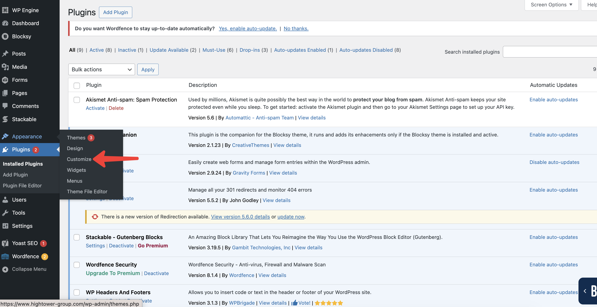
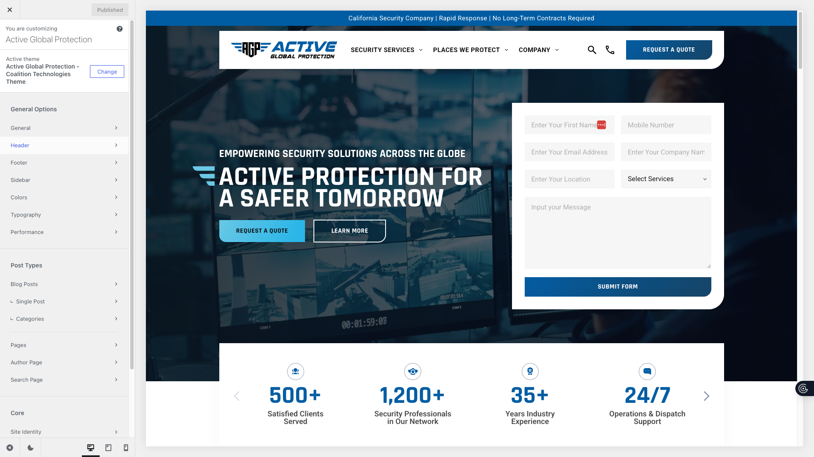

# Welcome to Taystee's Burgers theme by Coalition Technologies documentation

## Developers info

* Parent theme: Blocksy 2.1.49
* Child theme: blocksy-child (Taystee's Burgers - Coalition Technologies Theme)
* Blocks: Stackable - Gutenberg Blocks

## Custom Sections and Pages 
* [Header & Footer Scripts](header-footer/)
* [Menu](menu/)
* [Form](form/)
* [Wp Blocks](custom-sections/)

## Blocksy Theme Customizer Guide

The **Blocksy theme** provides a user-friendly WordPress **Theme Customizer**, allowing you to adjust the appearance and layout of your site in real time. This guide walks through all the main options and best practices.

---

## Accessing the Theme Customizer

1. Log in to your WordPress dashboard.
2. Navigate to **Appearance → Customize**.

3. The Customizer panel will open on the left, with a live preview on the right.

> **Note:** Changes are not visible on your site until you click **Publish**.

---

## Customizer Sections

Here we have all the theme settings 

## Site Identity

- **Site Title:** Update your site’s name.  
- **Tagline:** Add a short description for your site.  
- **Logo:** Upload your logo image (recommended size: 200x60px).  
- **Site Icon / Favicon:** Upload a 512x512px icon that appears in browser tabs.  

---

## Colors & Typography

- **Primary & Secondary Colors:** Customize theme accent colors.  
- **Background Color:** Set the site background color.  
- **Font Family & Size:** Choose fonts for headings, body, and menus.  
- **Link Colors:** Change link hover and active colors.  

---

## Header Options  
- **Header Settings:** Align menus and adjust spacing.
- **Sticky Header:** Enable a header that stays visible on scroll.  

---

## Blog / Archive

- **Layout Options:** Grid, list, or full-width blog layouts.  
- **Excerpt Length:** Control the number of words displayed per post.  
- **Featured Image Display:** Show or hide thumbnails on the blog page.  

---

## Footer Options

- **Footer Layout:** One, two, or three-column layout.  
- **Copyright Text:** Customize the copyright message.  
- **Footer Widgets:** Enable or disable widget areas.  

