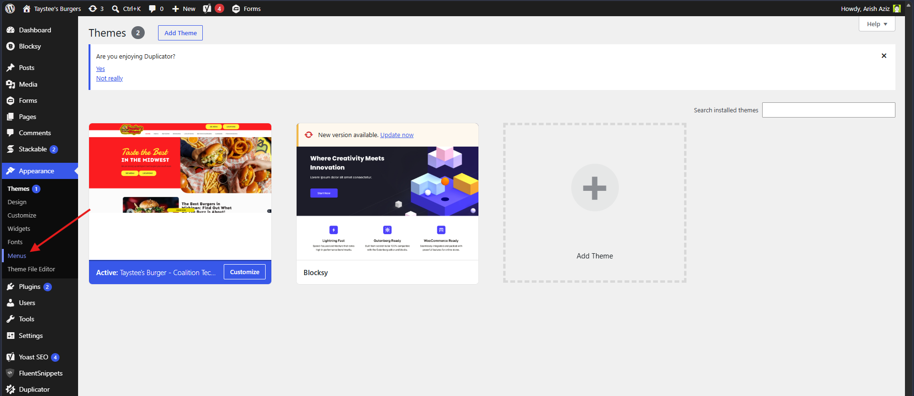
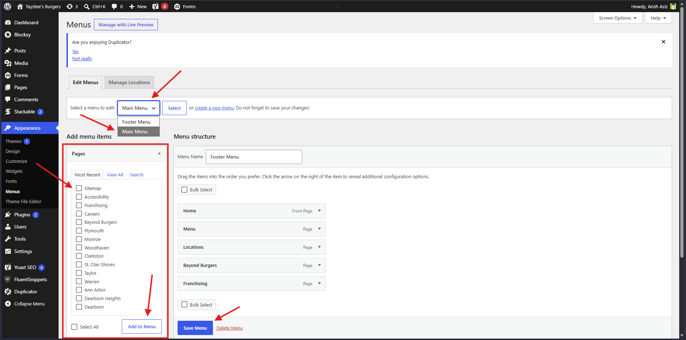

# Menu
1. WP Admin → Appearance → Menus.
2. Create/choose a menu, add Pages, Custom Links, Categories.

3. Arrange by drag & drop; set Display Location; Save.

## Editing Header/Footer Menu

1. Select a menu (Main menu is used for header navigation and Footer menu for footer)
2. The sidebar lists all the pages and posts from the website along with option to create a custom link.
3. Select the item need to be added into the menu and save the menu. Please use follow screenshot for reference:
